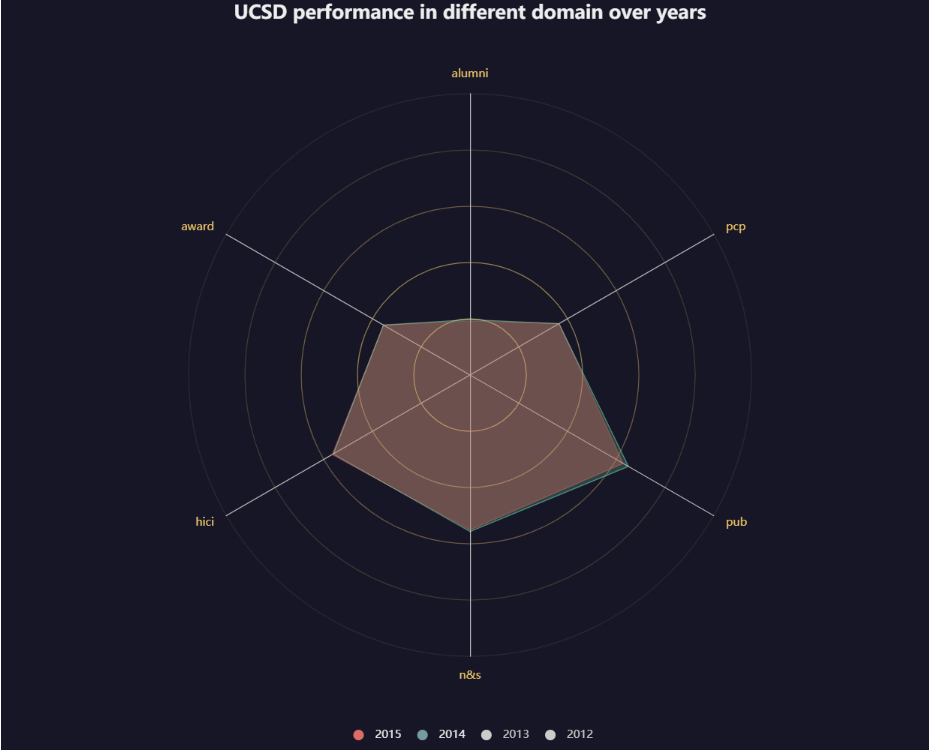
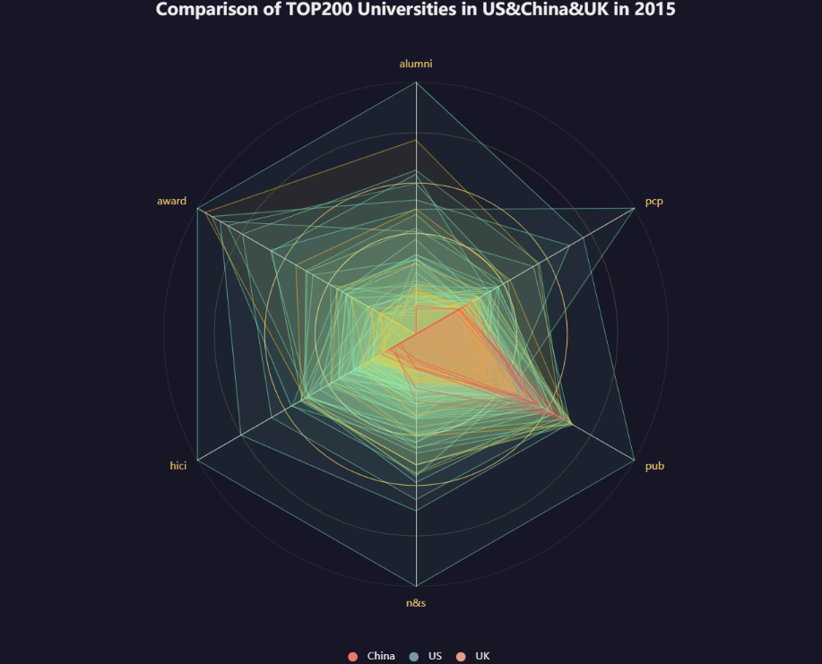

# University Rankings Analysis
ECE 143 Fall 2021 Final project - Group 11

This project compares different university ranking systems and the changing trends in rankings over the years. University rankings, though controversial, are very important for prospective undergraduate and graduate students to help choose the university which would be a good fit for them. This project aims to address the following questions:
- Are all the ranking systems consistent? 
- Would expenditure affect ranking?
- Which countries have the top-ranked universities and how does it change over time?

# Data
All the data we used is stored in the [data](./data) folder. This data is mostly from [kaggle](https://www.kaggle.com/mylesoneill/world-university-rankings?select=educational_attainment_supplementary_data.csv). Some supplementary education expenditure data was obtained from [UNESCO](http://data.uis.unesco.org/#). The following university rankings have been considered:
- Times Higher Education Rankings
- Center for World University Rankings (CWUR)
- Shanghai Ranking (aka) Academic Ranking of World Universities (ARWU)
# Visualisations and Analysis
We compared the rankings of different agencies over the years to see how different countries have performed in different rankings.
The rankings all agreed on USA as the country with the largest number of top ranked universities but there were differences for all other countries.
[Top 100 rankings of different ranking agencies over time](https://aarthy-22.github.io/ece-143/charts/line_chart.html)

From the chart above, Germany have a trand of increase over years and it is also associated with its educational spending.
[The number of top universities of Germany growth](https://github.com/aarthy-22/ece-143/blob/main/charts/PHOTO-2021-11-21-17-16-45.JPG).
[Normalized average educational spending ranking](https://github.com/aarthy-22/ece-143/blob/main/charts/Screen%20Shot%202021-12-03%20at%204.07.27%20PM.png)

Comparing educational spending of the country and the number of top 100 ranked universities in a country, we found some trends in certain cases but nothing conclusive,
[Educational spending vs rankings](https://aarthy-22.github.io/ece-143/charts/expenditure-rankings.html)

The United Stateds also play a dominant role from CWUR parameter comparison.[The visualisation from CWUR](https://github.com/aarthy-22/ece-143/blob/main/charts/9e4bc3e7-5a07-4a85-ab2c-e2a95170fea9.JPG)

Looking at UCSD's performace in different ranking metrics, UCSD has done consistently well in citations and international collaboration.

 

Comparing performance of top 200 universities in different countries (UK, USA and China), universities in USA do the best.

# Conclusions
The following conclusions have been drawn from the data analysis done:

- Rankings are not consistent across the different ranking systems since different systems give priorities to different factors. 
- Increase in expenditure resulted in better rankings for some countries but there is no clear correlation, since we also saw examples of high spending not resulting in better rankings and vice versa as well.
- There are no clear trends in rankings across countries over time, but USA dominates all the three different university ranking systems.
 

